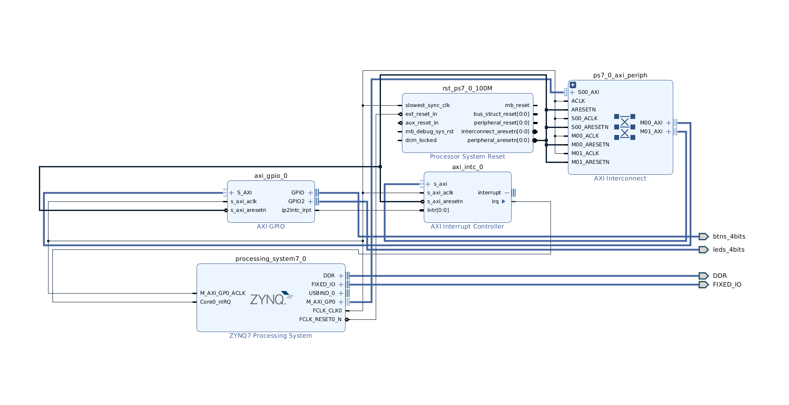
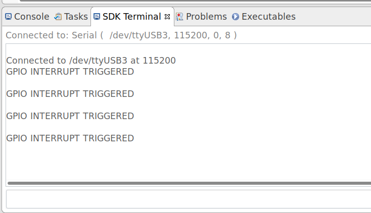

# Xilinx Axi Intc Example Usage for GPIO interrutps

# Design

# Run steps

### Export hardware in Vivao (File -> Export -> Eport Hardware)
### Open SDK From vivado (File -> Launch SDK)
### Add A New Application Project with standalone platform
### Remove the helloworld main file and copy the main.c source file (You can copy entire folder if working with a pynqZ2 board)
### You can now run the application and trigger interrupts by pressing on the buttons  

# Output
